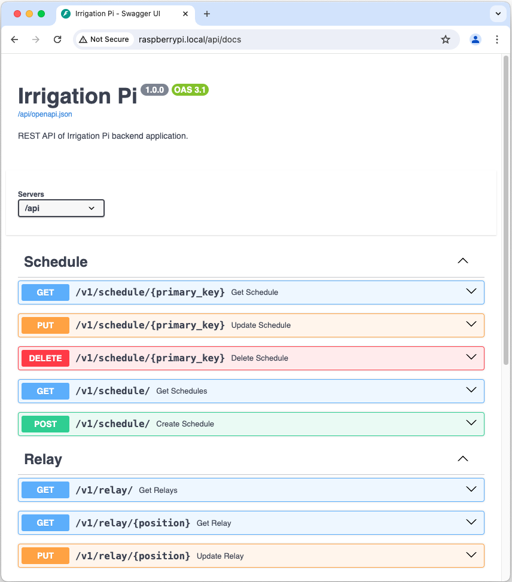

[](https://python-poetry.org/)
[](https://github.com/astral-sh/ruff)
[](https://codecov.io/gh/max-pfeiffer/irrigation-pi)


# Irrigation Pi
This web application turns your [Raspberry Pi](https://www.raspberrypi.com/) into an irrigation system.

There are several relay HATs from various manufactures available for the [Raspberry Pi](https://www.raspberrypi.com/).
This application currently supports the following boards:
* [Waveshare RPi Relay Board](https://www.waveshare.com/wiki/RPi_Relay_Board) (3 relays)

Contributions for other boards are warmly welcome.

## Features
* Add schedules for switching the relays
* Relays are switched automatically according to schedule configuration
* Mobile friendly web interface ([Angular](https://angular.io/) [frontend application](frontend/README.md) written in Typescript)
* REST API ([FastAPI](https://fastapi.tiangolo.com/) [backend application](backend/README.md) written in Python)

Following features are on our todo list:
* View for live relay switching
* View for Raspberry Pi system information
* Make host name for Raspberry Pi installation configurable
* SSL for web application

   



## Installation on Raspberry Pi
Installation on your Raspberry Pi is **easy**! It is quickly done within minutes.

Requirements:
* Raspbian GNU/Linux v11+
* git v2.30+
* Python v3.9+

Open a shell on your Raspberry Pi and clone this repository:
```shell
git clone https://github.com/max-pfeiffer/irrigation-pi.git
```

Then go to project directory and run the installer script. This script installs Poetry and Python package dependencies.
It also installs Debian package dependencies. Then it configures Irrigation-Pi application, nginx web server and
Uvicorn application server.
```shell
cd irrigation-pi
./install.sh
```
Depending on your Raspberry Pi's computing power and your network connection this might take a while.
On a Raspberry Pi 2 or 3 you need to be patient. :smiley: If package installation seems to got stuck,
just exit the script (CTRL-C) and re-run it.

The management CLI requires superuser privileges for installation. If you encounter a password challenge, please enter your user's
password.

The application is available on http://raspberrypi.local/ afterwards. The API can also be used directly
on http://raspberrypi.local/api.

All servers are configured to be fired up automatically after the Raspberry was switched on.

## Update
Change to your Irrigation Pi installation directory (where you pulled the repository). Then execute the update script: 
```shell
./update.sh
```
The update script is available since v1.1.0. If you are missing it, you are running some older version. Then you need 
to pull the latest changes from GitHub yourself like so:
```shell
git checkout main
git pull
```
Afterwards just run the update script.

## Configuration
Configuration files are generated by the management CLI during initial installation. Configuration of the
Irrigation-Pi application is done via the config.toml file in project directory:
```
[backend]
# Possible options are: rpi_gpio, pigpio, native
pin_factory_type = "rpi_gpio"

# Possible options are: waveshare_rpi_relay_board
adapter_type = "waveshare_rpi_relay_board"
```
This file can be altered after the installation if the default settings do not suit you. Currently, you can only tweak
the GPIO driver.

The backend application is served with [Uvicorn](https://www.uvicorn.org/) application server. This process is managed
by systemd. You can find the systemd service definition in `/etc/systemd/system/irrigation-pi.service` on your Raspberry Pi.

The frontend application is served with [nginx](https://nginx.org/) web server. The site configuration file can be
found in `/etc/nginx/sites-available/irrigation-pi` on your Raspberry Pi.

## Management CLI
Irrigation Pi comes with its own management CLI. With the CLI you can perform installation and configuration tasks
for the application and servers. Use the `--help` option to find out more about commands and usage.
```shell
$ irrigation-pi --help
Usage: irrigation-pi [OPTIONS] COMMAND [ARGS]...

  Irrigation Pi command line interface (CLI).

  CLI provides common operations for configuring and running the application.

  Run 'irrigation-pi COMMAND --help' for more information about commands and
  usage.

Options:
  --help  Show this message and exit.

Commands:
  export     Update commands.
  install    Install commands.
  run        Run commands.
  uninstall  Uninstall commands.
```
For instance, you can install and run a Wi-Fi hotspot with it:
```shell
$ sudo irrigation-pi install wifi-hotspot
```

## Why another irrigation controller software for the Raspberry Pi?
First of all I was searching GitHub and the web for ready to use solutions. And I found a couple.
Some of them did not match my use case: I just want a simple and easy to use application for watering plants on my
balcony and in my garden. I have no need for watering zones, sensors or other complications. These things need a lot of
effort to set up and maintain. Not only software configuration but also the hardware, wiring, pipes etc.
And I am a lazy person and a lazy gardener. :smiley: I like to keep things simple and work less.

Also, a lot of these projects on GitHub did grow out of hand for the maintainers and are now outdated or simply do not
work anymore. Often they leverage big ass frameworks, databases like MongoDB or depend on Docker. All this I do not
want to run on my good old Raspberry Pi 3 with little computing power. And no, I do not want to buy a Raspberry Pi 5
for 100 Euro for simple use cases like watering my plants on the balcony when a device for 30 Euro can do the job.

Also, I want to use my Irrigation-Pi in my garden where I only have solar power from a battery. Here I have an island
solution and the need for very little power consumption. The latest Raspberry Pi hardware versions suck a lot more
energy than the old boards.

This project aims to just use what comes with Raspbian OS pre-installed with very little other dependencies.
Also, installation, updates or maintenance should be fully automated. I do want to mess around on my Pi with config and
software updates. And because I am lazy. :smiley:
